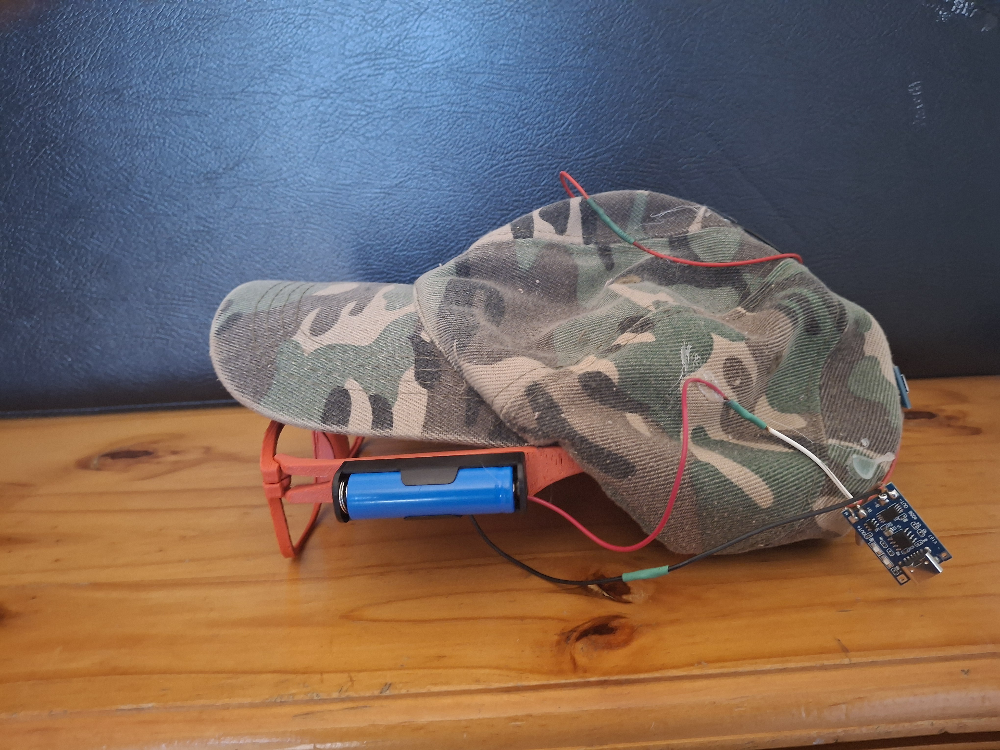
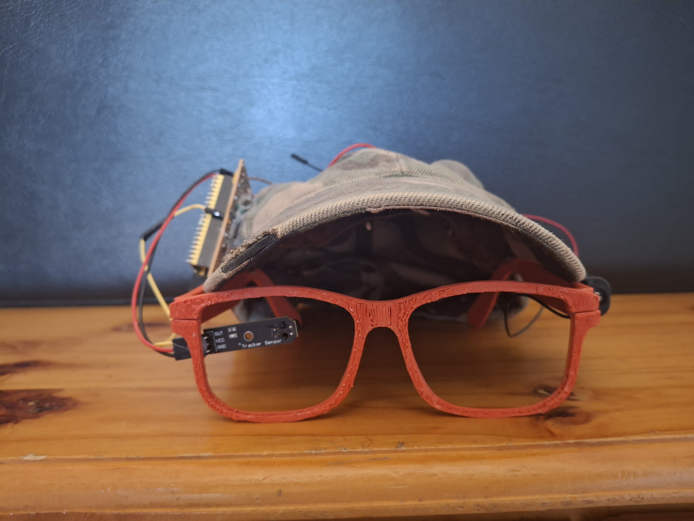
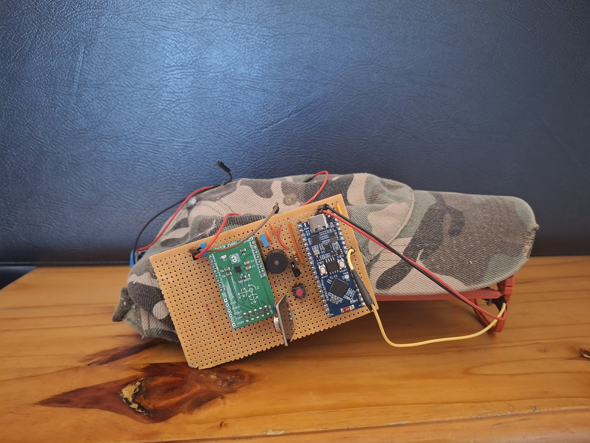
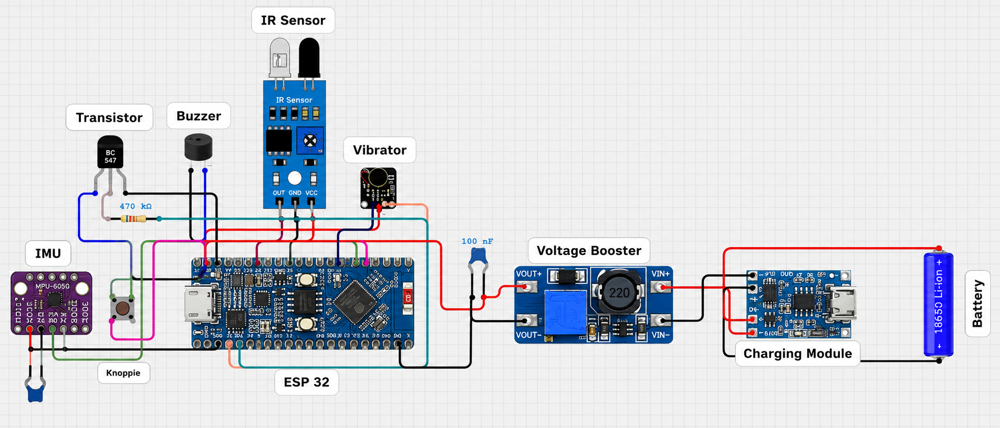
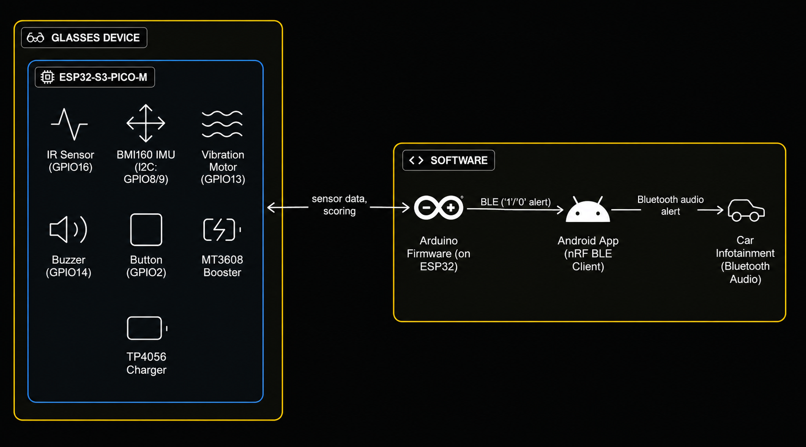
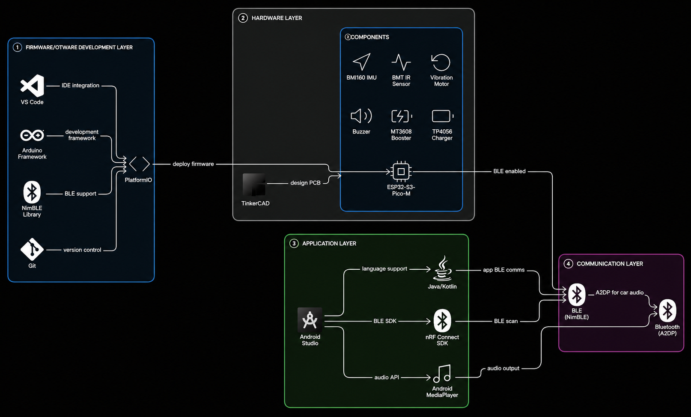

# AI-Powered Driver Fatigue Detection System

<div align="center">


### Final-Year Bachelor of Information Technology Capstone Project  
**Belgium Campus iTversity**

An IoT-based wearable system that detects driver fatigue using smart glasses and alerts the driver through haptic feedback, an Android application, and the vehicle's speakers.

</div>

---

## 📑 Table of Contents

- [Project Gallery](#-project-gallery)
- [Project Walkthrough](#-project-walkthrough)
- [Overview](#-overview)
- [The Problem](#-the-problem)
- [The Solution](#-the-solution)
- [System Workflow](#-system-workflow)
- [My Role](#-my-role)
- [Technologies Used](#-technologies-used)
- [Repository Contents](#-repository-contents)
- [Key Features](#-key-features)
- [Key Skills Demonstrated](#-key-skills-demonstrated)
- [Future Improvements](#-future-improvements)
- [Project Outcomes](#-project-outcomes)

---

# 📸 Project Gallery

<div align="center">

<table>
<tr>

<td align="center">
<br>
<strong>Smart Glasses (Left)</strong>
</td>

<td align="center">
<br>
<strong>Smart Glasses (Front)</strong>
</td>

<td align="center">
<br>
<strong>Smart Glasses (Right)</strong>
</td>

</tr>

<tr>

<td align="center">
<br>
<strong>Hardware Architecture</strong>
</td>

<td align="center">
<br>
<strong>Overall System Architecture</strong>
</td>

<td align="center">
<br>
<strong>Technology Stack</strong>
</td>

</tr>
</table>

</div>

---

# 🎥 Project Walkthrough

The complete walkthrough video explains the project from start to finish, including the planning, implementation, and live demonstration.

▶ **Watch here:**

https://youtu.be/BF8eujmj6Ng?si=zZ3N7GMi3SAXTKAK

---

# 📖 Overview

This project was developed as my final-year Bachelor of Information Technology capstone project at Belgium Campus iTversity.

The goal of the project was to create a wearable driver fatigue detection system capable of identifying signs of drowsiness and alerting the driver before an accident occurs. The solution uses smart glasses fitted with sensors to monitor eye closure and head movement, providing real-time alerts whenever fatigue is detected.

The project combines embedded systems, IoT, mobile connectivity, and AI concepts to create a working prototype focused on improving road safety.

---

# 🚗 The Problem

Driver fatigue is one of the leading causes of road accidents worldwide. Existing solutions are often expensive, require specialised vehicle hardware, or rely heavily on camera-based monitoring systems.

The objective of this project was to investigate whether a lightweight, wearable, and affordable solution could effectively monitor signs of drowsiness and provide immediate feedback to the driver.

---

# 💡 The Solution

The system uses a combination of sensors mounted on a pair of smart glasses:

- TCRT5000 IR sensor to detect prolonged eye closure
- MPU6050 IMU sensor to detect head movement associated with fatigue
- ESP32-S3 microcontroller for real-time processing
- Piezo buzzer and vibration motor to alert the driver
- Bluetooth Low Energy (BLE) communication with an Android application

When signs of drowsiness are detected, the glasses immediately alert the driver using vibration and sound.

At the same time, the ESP32 sends a notification via Bluetooth Low Energy to the Android application. The application then connects to the vehicle via Bluetooth and plays audible warning messages through the car's speakers, providing an additional layer of alerting without requiring the driver to look at their phone.

---

# 🔄 System Workflow

```text
Driver
   │
   ▼
Smart Glasses
   │
   ▼
ESP32-S3
   │
Bluetooth Low Energy
   │
   ▼
Android Application
   │
Bluetooth
   │
   ▼
Vehicle Speakers
```

---

# 👨‍💼 My Role

I served as the project leader for an 8-member multidisciplinary team throughout the project.

My responsibilities included:

- Planning project milestones and deliverables
- Coordinating team activities
- Assigning and tracking tasks
- Managing timelines and overall project progress
- Assisting with hardware integration
- Supporting software development
- Testing and troubleshooting the complete system

Alongside my leadership responsibilities, I also contributed to the technical implementation of the solution.

---

# 🛠 Technologies Used

| Hardware | Software |
|----------|----------|
| ESP32-S3 | PlatformIO |
| TCRT5000 IR Sensor | Arduino Framework |
| MPU6050 IMU | C++ |
| Piezo Buzzer | Android |
| Vibration Motor | Bluetooth Low Energy |
| Lithium-Ion Battery | TensorFlow Lite Micro (Research & Experimentation) |
| TP4056 Charging Module | |
| MT3608 Boost Converter | |

---

# 📂 Repository Contents

This repository includes:

- 📄 Project planning documentation
- 📸 Project images
- 📐 Hardware architecture diagrams
- 🏗 System architecture diagrams
- ⚙ Technology stack overview
- 🎥 Full project walkthrough video

> **Note**
>
> The original source code for this university project was unfortunately lost after the project was completed. This repository has been created to preserve the project's planning, design decisions, system architecture, implementation walkthrough, and demonstration of the completed prototype.

---

# 🎬 What the Walkthrough Covers

The walkthrough video provides a complete overview of the project, including:

- Project objectives
- System architecture
- Hardware architecture
- Technology stack
- Codebase walkthrough
- Explanation of how each hardware component communicates
- Explanation of the software used for each component
- Live demonstration of the completed prototype
- Communication between the glasses, Android application, and vehicle speakers

---

# ⭐ Key Features

- Real-time eye closure detection
- Head movement monitoring
- Wearable smart glasses
- Vibration alerts
- Audible alerts
- Android companion application
- Bluetooth Low Energy communication
- Vehicle speaker integration
- Modular hardware and software architecture

---

# 💼 Key Skills Demonstrated

- Project Leadership
- Team Coordination
- Embedded Systems Development
- Internet of Things (IoT)
- Mobile Application Development
- Bluetooth Low Energy (BLE)
- Hardware & Software Integration
- Artificial Intelligence Concepts
- Systems Design
- Problem Solving
- Testing & Troubleshooting

---

# 🚀 Future Improvements

If I were to continue developing this project, I would explore:

- More advanced AI models for fatigue detection
- Improved sensor calibration and accuracy
- Cloud-based monitoring and analytics
- Integration with vehicle infotainment systems
- Enhanced Android application functionality
- Driver behaviour logging and analytics
- Machine learning models trained on larger datasets

---

# ✅ Project Outcomes

- Successfully designed and developed a working driver fatigue detection prototype
- Led an 8-member multidisciplinary development team
- Integrated embedded hardware, mobile software, Bluetooth communication, and AI concepts into a single solution
- Demonstrated the completed project at the Belgium Campus Final-Year Project Showcase

---

## Project Status

✅ Completed as a final-year Bachelor of Information Technology capstone project at Belgium Campus iTversity.
